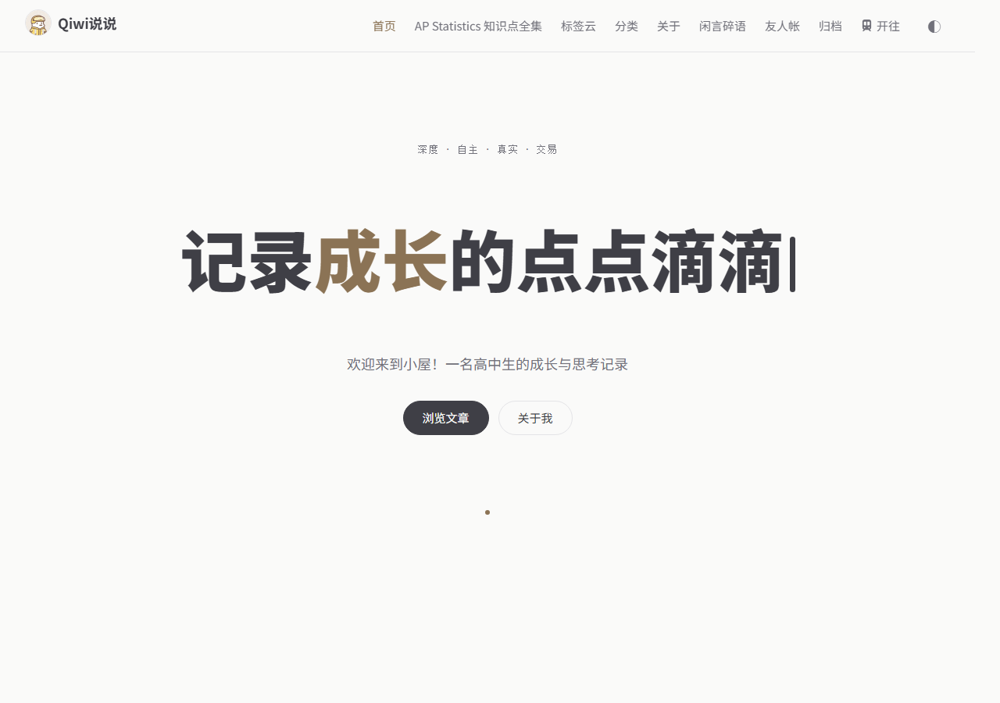

# QIWI Theme

A clean, minimalist dark theme for Typecho.

The idea of this theme is to provide a simple and elegant design with a focus on readability. LaTex is supported in article renderer. 

Author is using this theme.

## Features

- Dark minimalist design
- Responsive layout
- Custom CSS variables for easy theming
- Support for tables with alignment
- Clean typography
- Sidebar widgets
- Comment system
- Search functionality

## Installation

1. Download the theme files
2. Upload the `qiwi` folder to your Typecho themes directory (`usr/themes/`)
3. Activate the theme in your Typecho admin panel

## Customization

The theme uses CSS custom properties (variables) for easy customization. Edit the variables in `style.css` to change colors, spacing, and typography.

## License

This theme is released under the MIT License. See the LICENSE file for more details.