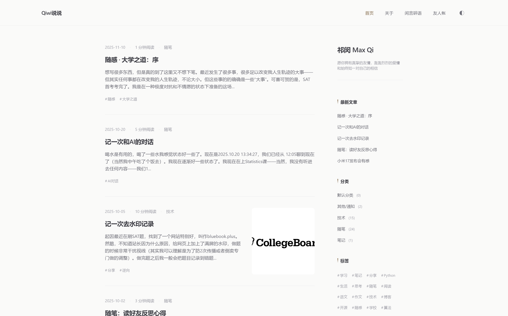

# Qiwi Typecho Theme

Qiwi 是一个面向 Typecho 的极简博客主题，当前版本为 `v1.3.5`。主题以阅读体验为核心，提供响应式布局、昼夜模式、文章目录、友链页、归档统计、时光机说说、内容短代码和可视化后台配置。



## 主要特性

- 简洁克制的文章列表、详情页和独立页面排版
- 响应式布局，桌面端保留侧栏，小屏下自动堆叠
- 昼夜模式切换，并记住访客偏好
- 可配置顶部导航，支持独立页面、模板页面、站内路径、外链、二级菜单和 Font Awesome 图标
- 首页即刻条，可从时光机页面提取最新动态
- 文章置顶、缩略图、自定义摘要、阅读时间、浏览量和标签展示
- 文章/页面侧边目录，支持按单篇内容关闭
- LaTeX 自动检测渲染，兼容 `$...$`、`$$...$$`、`\(...\)` 与 `\[...\]`
- 正文图片桌面端灯箱预览，移动端保留原生浏览体验
- Markdown 短代码：彩色文字、高亮标记和折叠面板
- 归档页写作统计，支持自定义“等价书籍”参考
- 分类页、标签云、友链页、关于页、时光机页面模板
- 评论区资料弹窗、验证码接入和友链申请表单
- 后台版本检查、更新日志卡片和 Linux 更新脚本

## 环境要求

- Typecho `1.2.x`
- PHP 版本以当前 Typecho 站点可运行为准
- 主题无前端构建步骤，上传后即可使用

可选能力：

- Geetest 插件：用于评论验证码
- Font Awesome：导航图标和时光机图标会按需加载
- KaTeX：文章或页面检测到 LaTeX 后按需加载

## 安装

1. 下载或克隆本主题。
2. 将 `qiwi` 目录放入 Typecho 的 `usr/themes/` 目录。
3. 进入 Typecho 后台，打开“控制台 -> 外观”，启用 `Qiwi`。
4. 进入“设置外观”，按站点需要配置导航、友链、关于页、侧边栏和更新检查。

目录结构示例：

```text
usr/
└── themes/
    └── qiwi/
        ├── assets/
        ├── components/
        ├── functions.php
        ├── index.php
        ├── post.php
        └── README.md
```

## 页面模板

Qiwi 内置多个独立页面模板。新建独立页面后，在页面模板中选择对应模板即可。

| 模板文件 | 用途 |
| --- | --- |
| `page-about.php` | 关于页面，展示头像、简介、正文和评论 |
| `page-friends.php` | 友链页面，展示分类友链和友链申请表单 |
| `page-timemachine.php` | 时光机页面，用评论系统发布和展示说说 |
| `page-archives.php` | 归档页面，展示写作统计和文章时间线 |
| `page-categories.php` | 分类页面，展示全部分类和文章数量 |
| `page-tags.php` | 标签云页面，展示全部标签和关联数量 |

## 主题配置

### 顶部导航

导航配置在主题设置里的“顶部导航配置”。留空时，主题会自动显示可展示的独立页面。

手动配置时，每行一个导航项：

```text
归档|template:page-archives.php|fa-solid fa-box-archive
- 分类|template:page-categories.php|fa-solid fa-folder
- 标签|template:page-tags.php|fa-solid fa-tags
关于|slug:about|fa-solid fa-user
外链|https://example.com|fa-solid fa-arrow-up-right-from-square
```

链接支持：

- 完整 URL：`https://example.com`
- 站内路径：`/about.html`
- 页面 slug：`about`、`slug:about`、`page:about`
- 页面模板：`template:page-tags.php`

二级菜单在行首加 `-`。图标类名可使用 Font Awesome，例如 `fa-solid fa-tags`。

### 首页即刻条

开启后，首页会从时光机页面读取最新动态并轮播展示。可在主题设置中选择展示位置和时间显示方式。

### 友链数据

友链数据在主题设置中维护，支持分类、排序、头像和描述。友链页面正文会显示在友链列表之后、申请表单之前，适合放交换说明或站点要求。

### 归档书籍统计

归档页可以根据累计字数显示“相当于读/写了多少本书”的参考数据。书籍参考可在主题设置中增删和排序。

### 更新检查

`v1.3.5` 默认通过 GitHub Contents API 读取 `update.json`，避免 raw 文件缓存造成版本提示延迟。后台可切换更新源，也可以隐藏主题设置页顶部的更新提示卡片。

Linux 环境可在主题目录执行：

```bash
bash update.sh
```

如果 Typecho 根目录与主题目录存在 Docker、挂载目录等路径差异，可在后台更新设置里手动指定根目录。

## 文章与页面字段

文章字段：

- `文章 - 自定义摘要`：覆盖列表页自动摘要
- `文章 - 显示缩略图`：控制列表页缩略图展示
- `文章 - 缩略图地址`：设置文章缩略图
- `文章 - 置顶文章`：置顶文章会在首页优先展示

通用字段：

- `通用 - LaTeX 渲染`：默认关闭，检测到公式时可按需开启
- `通用 - 侧边目录`：默认显示，可按单篇文章或页面关闭

页面字段：

- `页面 - 友链页副标题`：用于友链页标题下方说明
- `页面 - 顶部导航栏展示`：控制自动导航是否显示该独立页面

## Markdown 短代码

Qiwi 从 `v1.3.0` 开始支持正文短代码，当前 `v1.3.5` 可在文章和独立页面正文中使用。短代码会在 Typecho 输出 Markdown/HTML 后再渲染，因此可以和普通 Markdown 混写；代码块和行内代码里的短代码不会被解析。后台文章/页面编辑器预览也会尽量按同一规则显示这些短代码效果。

### 彩色文字

```markdown
[red]红色文字[/red]
[orange]橙色文字[/orange]
[yellow]黄色文字[/yellow]
[green]绿色文字[/green]
[cyan]青色文字[/cyan]
[blue]蓝色文字[/blue]
[purple]紫色文字[/purple]
```

支持的颜色固定为：`red`、`orange`、`yellow`、`green`、`cyan`、`blue`、`purple`。

### 标记高亮

默认高亮为黄色：

```markdown
这是一段 [mark]默认黄色高亮[/mark] 的文字。
```

也可以指定颜色：

```markdown
[mark color=blue]蓝色高亮[/mark]
[mark color="green"]绿色高亮[/mark]
[mark color='purple']紫色高亮[/mark]
```

如果传入不支持的颜色，会回退为 `yellow`。

### 折叠内容

```markdown
[fold]
这里是默认标题的折叠内容。
[/fold]
```

默认标题为“展开内容”。推荐显式设置标题：

```markdown
[fold title="剧透内容"]
这里可以写 **Markdown**、链接、图片、列表等正文内容。
[/fold]
```

标题支持双引号、单引号或不带引号：

```markdown
[fold title='更多信息']
单引号标题。
[/fold]

[fold title=提示]
不带引号时，标题不能包含空格。
[/fold]
```

折叠面板最多支持约 4 层嵌套。建议把 `[fold ...]` 和 `[/fold]` 单独放在一行，让 Markdown 段落结构更稳定。

### 混合示例

````markdown
[fold title="阅读提示"]
这篇文章包含 [mark color=cyan]实验性观点[/mark]。

- [green]适合快速阅读[/green]
- [orange]部分内容需要上下文[/orange]

```php
// 代码块里的 [red]短代码[/red] 不会被主题解析
echo 'hello qiwi';
```
[/fold]
````

文章卡片摘要会尽量保留可读文本：彩色文字和高亮标记会去掉短代码标签但保留文字；折叠内容会把标题和正文一起纳入摘要文本。评论内容目前不走这套短代码渲染逻辑。

## 开发说明

Qiwi 没有构建步骤，主题文件会被 Typecho 直接加载。

常用文件：

- `header.php`：页面头部、全局导航、资源加载入口
- `footer.php`：页脚、主题切换、目录、图片灯箱、代码复制等脚本
- `functions.php`：主题设置、字段、导航解析、短代码、浏览量和版本配置
- `assets/css/style.css`：主题主样式
- `assets/css/admin-config.css`：后台配置样式
- `index.php`：首页文章列表和置顶聚合
- `post.php`：文章详情页
- `comments.php`：评论列表和评论表单
- `version.php`：前台版本弹窗和版本号
- `update.json`：远程更新检查数据

修改 PHP 模板后建议运行：

```bash
php -l header.php footer.php index.php archive.php post.php page.php page-about.php page-friends.php page-timemachine.php comments.php sidebar.php functions.php
```

没有全局 `php` 命令时，可使用 phpstudy 内置 PHP，例如：

```powershell
& 'D:\phpstudy_pro\Extensions\php\php7.3.4nts\php.exe' -l functions.php
```

## 许可证

本主题基于 MIT License 发布，详见 [LICENSE](LICENSE)。
